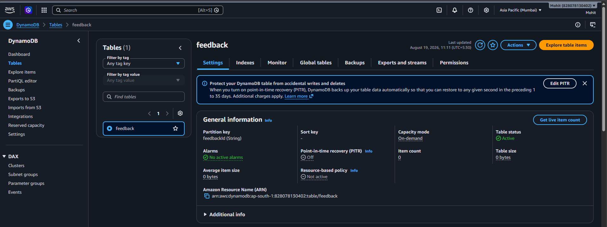
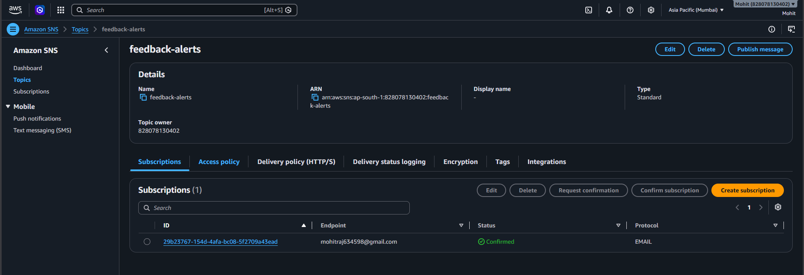
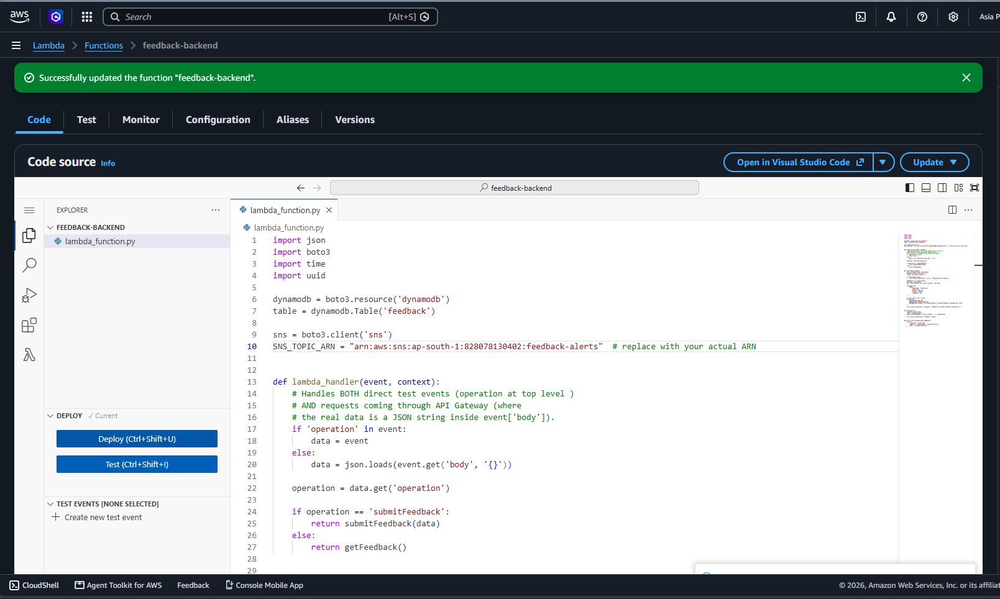
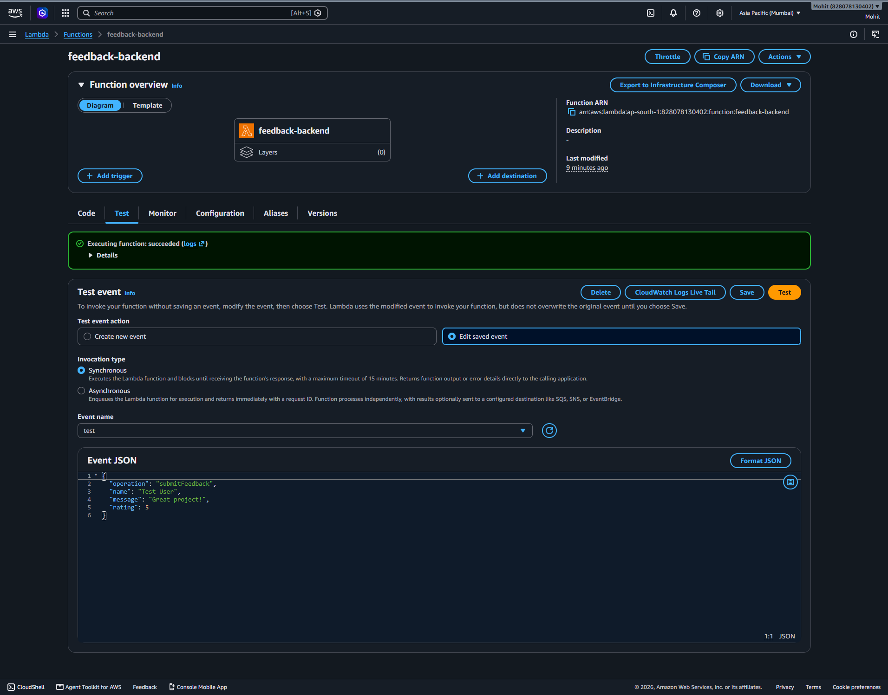
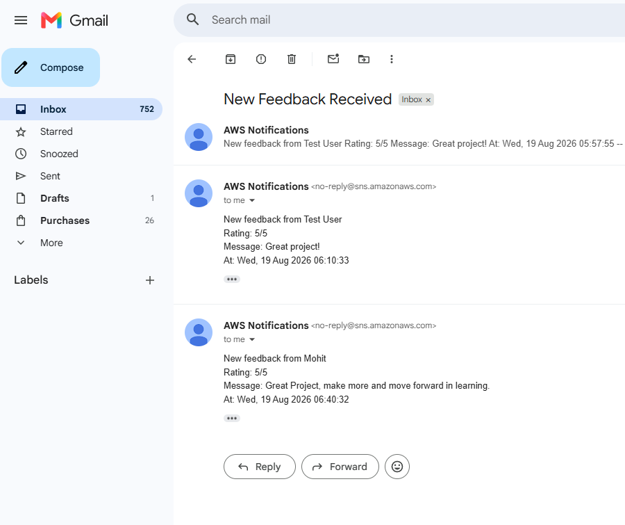
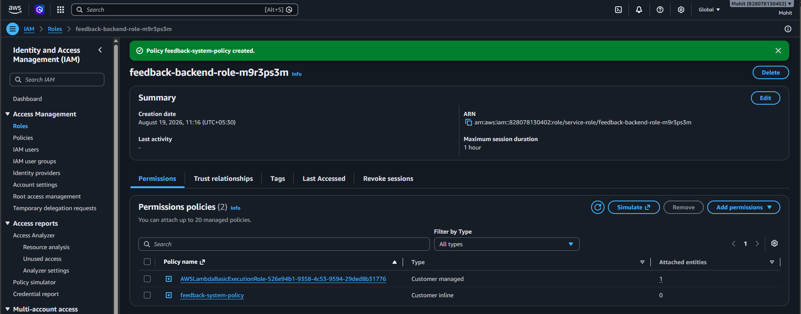
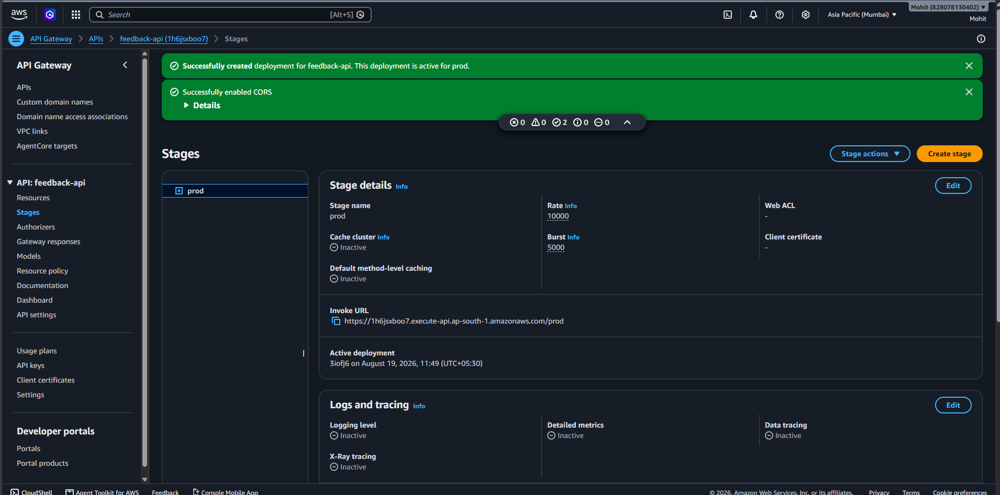
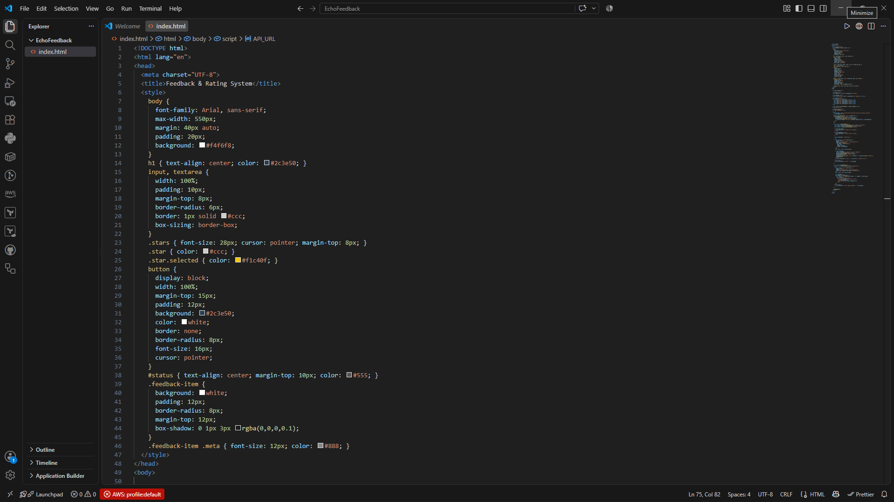
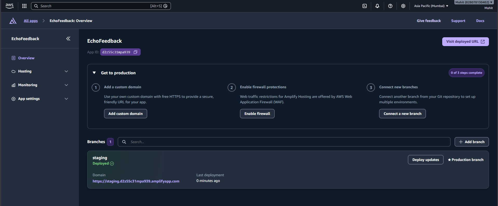
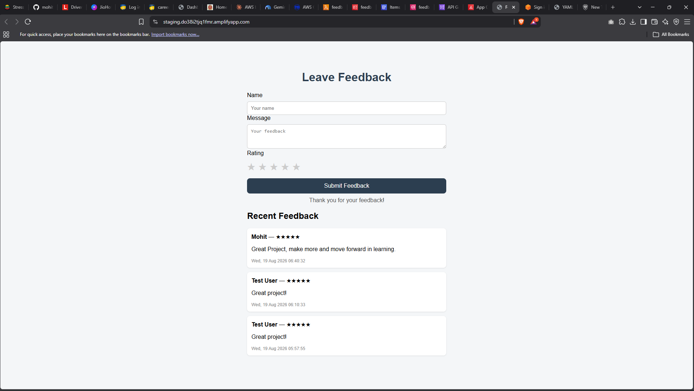

# EchoFeedback

A web-based feedback and rating system with live results and instant email alerts, built on AWS (DynamoDB, Lambda, SNS, API Gateway, Amplify).

## How it works

1. User submits their name, a message, and a star rating on the webpage
2. The page sends the data to a Lambda function through a REST API (API Gateway)
3. Lambda saves the feedback to DynamoDB and publishes an alert to SNS at the same time
4. An email notification arrives immediately
5. The page re-fetches and displays all feedback live, with star ratings shown

## Services used

- **DynamoDB** — stores each feedback entry
- **Lambda** — backend logic connecting everything, using an `operation`-based routing pattern
- **SNS** — sends an email alert the moment new feedback is submitted
- **API Gateway (REST API)** — exposes the Lambda function as a POST endpoint
- **AWS Amplify** — hosts the frontend webpage
- **IAM** — scoped permissions (DynamoDB PutItem/Scan + SNS Publish, restricted to this project's specific resources only)

## Screenshots

### DynamoDB table


### SNS topic with confirmed subscription


### Lambda code deployed


### Lambda test executed successfully


### Email alert received


### Scoped IAM policy


### REST API deployed (API Gateway)


### Frontend code


### AWS Amplify dashboard


### Live demo on Amplify


## Lambda function code

```python
import json
import boto3
import time
import uuid
from decimal import Decimal

dynamodb = boto3.resource('dynamodb')
table = dynamodb.Table('feedback')

sns = boto3.client('sns')
SNS_TOPIC_ARN = "arn:aws:sns:ap-south-1:828078130402:feedback-alerts"


class DecimalEncoder(json.JSONEncoder):
    def default(self, obj):
        if isinstance(obj, Decimal):
            return int(obj) if obj % 1 == 0 else float(obj)
        return super(DecimalEncoder, self).default(obj)

sns = boto3.client('sns')
SNS_TOPIC_ARN = "arn:aws:sns:ap-south-1:xxxxxxxxxxxx:feedback-alerts"  # replace with your actual ARN


def lambda_handler(event, context):
    # Handles BOTH direct test events (operation at top level )
    # AND requests coming through API Gateway (where
    # the real data is a JSON string inside event['body']).
    if 'operation' in event:
        data = event
    else:
        data = json.loads(event.get('body', '{}'))

    operation = data.get('operation')

    if operation == 'submitFeedback':
        return submitFeedback(data)
    else:
        return getFeedback()


def submitFeedback(data):
    name = data.get('name', 'Anonymous')
    message = data.get('message', '')
    rating = data.get('rating', 0)

    if not message.strip():
        return build_response(400, {'error': 'Message cannot be empty'})

    feedback_id = str(uuid.uuid4())
    gmt_time = time.gmtime()
    now = time.strftime('%a, %d %b %Y %H:%M:%S', gmt_time)

    table.put_item(
        Item={
            'feedbackId': feedback_id,
            'name': name,
            'message': message,
            'rating': rating,
            'createdAt': now
        }
    )

    # Send an email alert via SNS
    sns.publish(
        TopicArn=SNS_TOPIC_ARN,
        Subject="New Feedback Received",
        Message=f"New feedback from {name}\nRating: {rating}/5\nMessage: {message}\nAt: {now}"
    )

    return build_response(200, {'message': f'Feedback from {name} submitted successfully'})


def getFeedback():
    response = table.scan()
    items = response['Items']
    items.sort(key=lambda x: x.get('createdAt', ''), reverse=True)

    return build_response(200, {'feedback': items})


def build_response(status_code, body_dict):
    return {
        'statusCode': status_code,
        'headers': {
            'Content-Type': 'application/json',
            'Access-Control-Allow-Origin': '*'
        },
        'body': json.dumps(body_dict, cls=DecimalEncoder)
    }
```

## Frontend

See [`index.html`](index.html) in this repo for the full page code.